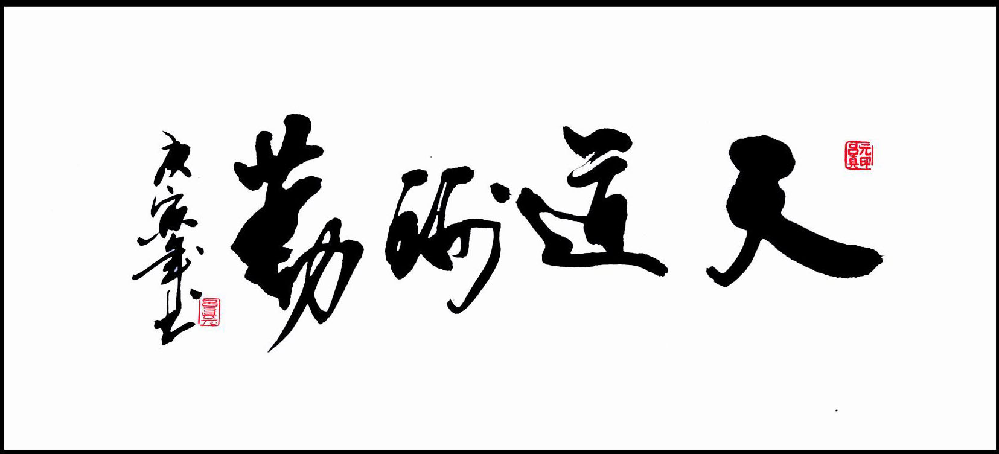

title: 关于
date: 2015-11-24 15:01:55
---
### 梦想，不是浮躁，而是沉淀和积累，只有拼出来的美丽，没有等出来的辉煌 #

**Linux云服务器架构师**

> 时间流失得很快，从毕业至今已经6个年头了，但是自己仍然只是一个程序开发的小兵，没任何建树，不仅可悲，而且特别可怕。男人三十而立，如果到了三十岁还是今天的这个样子和处境，那这一生可能就注定是碌碌无为了。儿时的豪言壮语，儿时的理想，儿时的志向不停的击打着我的心，提醒我说，目前的状态这不可是我想要的，我的能量不只有这么一点点，这不可能是我能达到的最高高度。

